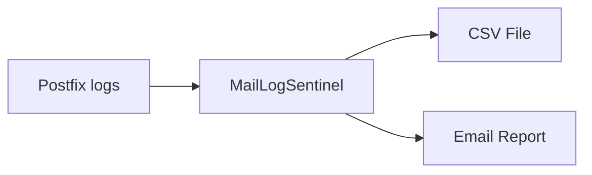

# MailLogSentinel

<p align="center">
  
</p>

<p align="center">
A simple monitoring tool for Postfix mail servers.
</p>

<p align="center">
   
   
   
   
  
  
  
</p>


---

## Table of Contents

- [Introduction](#introduction)
- [Quick Start](#quick-start)
- [Architecture & Visuals](#architecture--visuals)
- [Generated email](#generated-email)
- [Generated CSV Structure](#generated-csv-structure)
- [Generated logs](#generated-logs)
- [Full documentation](#full-documentation)
- [Contributing](#contributing)
- [Roadmap](#roadmap)
- [License](#license)
- [Support](#support)

---

## Introduction

Running your own mail server (Postfix) can feel like playing with fire: initial setup, securing, maintenance – and then daily brute-force attacks on your authentication.

**MailLogSentinel** automates log analysis to detect intrusion attempts in real time. It:

- Scans Postfix & Dovecot logs (including rotated archives)
- Identifies failed SASL authentications
- Extracts key details (date, server, IP, username, hostname)
- Appends findings to a CSV file
- Sends concise email summaries on schedule

No complex frameworks—just Python 3 and standard libraries, plus your existing mail server and Fail2ban.

---

## Quick Start

1. **Clone the repository**
 ```bash
git clone https://github.com/cryptozoide/MailLogSentinel.git
cd MailLogSentinel
```

2. **Install the script**
```bash
chmod +x maillogsentinel.py && sudo cp maillogsentinel.py /usr/local/bin/
```

3. Run for the first time in interactive mode
```bash
sudo /usr/local/bin/maillogsentinel --setup
```

> [!WARNING]
> Read the [Wiki](https://github.com/cryptozoide/MailLogSentinel/wiki) before the first run for more information. 

## Architecture & Visuals



## Generated email
```
##################################################
### MailLogSentinel v1.0.4-B                     ###
### Extraction interval : hourly                 ###
### Report at 2025-05-27 23:50                   ###
### Server: 33.44.55.66   (my_server.fqdn)       ###
##################################################

Total attempts today: 40

Top 10 failed authentications today:
   1. user.1@domain.tld			220.182.17.122		null                                        1 times
   2. user.1				81.189.180.120		null                                        1 times
   3. qijoxuli@domain.tld		31.25.31.12		121.31.25.31.convex-tagil.ru                1 times
   4. qijoxuli				124.155.204.160		124.155.204-160.unknown.starhub.net.sg      1 times
   5. user2@domain.tld			91.45.76.228		p5b2d4ce4.dip0.t-ipconnect.de               1 times
   6. user2				158.222.23.245		null                                        1 times
   7. info@domain.com			208.56.156.50		dynamic-208.56.156.50.tvscable.com          1 times
   8. user.1@domain.tld			74.208.177.56		null                                        1 times
   9. user.12				151.249.66.31		null                                        1 times
  10. info@domain.com			73.197.194.98		c-73-197-194-98.hsd1.nj.comcast.net         1 times

Top 10 Usernames today:
   1. user.1			7 times
   2. user.1@domain.tld		6 times
   3. contact@domain.com	3 times
   4. user2@domain.tld		2 times
   5. user2			2 times
   6. info@domain.com		2 times
   7. contact			2 times
   8. other			2 times
   9. qijoxuli@domain.tld	1 times
  10. qijoxuli			1 times

--- Reverse DNS Lookup Failure Summary ---
Total failed reverse lookups today: 26
Breakdown by error type:
  Errno 1 : 24
  Errno 2 :  2

Total CSV file size: 241.1K
Total CSV lines:     3613

Please see attached: maillogsentinel.csv

For more details and documentation, visit: https://github.com/cryptozoide/MailLogSentinel/blob/main/README.md
```

## Generated CSV Structure
`reports/intrusions.csv` columns:
|server|date|ip|user|hostname|reverse_dns_status|
|--------|--------------------|-----------------|--------------|--------------------|---------|
| srv01  | 2025-05-17 11:13   | 105.73.190.126  | office@me    | null               | Errno 1 |
| srv01  | 2025-05-17 12:05   | 81.30.107.24    | contribute   | mail.example.com   | OK      |
| srv02  | 2025-05-17 13:45   | 192.0.2.45      | admin        | host.example.org   | OK      |

Each new intrusion record is appended automatically.

## Generated logs
```
2025-05-29 00:00:00,315 INFO === Start of MailLogSentinel v1.0.4-B ===
2025-05-28 23:50:04,990 DEBUG Read CSV line: Server='srv', Date='01/05/2025 02:28', IP='188.255.34.171', User='admin@libranet.fr', Hostname='broadband-188-255-34-171.ip.moscow.rt.ru', DNS Status='OK'. Comparing Date with '28/05/2025'.
2025-05-29 00:00:00,315 DEBUG Files to process: [PosixPath('/var/log/mail.log')], starting from offset: 1198314
2025-05-29 00:00:00,315 INFO Processing /var/log/mail.log (gzip: False)
2025-05-29 00:00:00,316 INFO Incremental read of /var/log/mail.log from 1198314
2025-05-29 00:00:00,351 DEBUG Using valid cached DNS entry for 206.231.72.34 (timestamp: 1748469600.351121).
2025-05-29 00:00:00,351 DEBUG Reverse lookup failed for IP 206.231.72.34: Errno 1
2025-05-29 00:00:00,353 DEBUG Using valid cached DNS entry for 120.157.82.240 (timestamp: 1748469600.3531048).
2025-05-29 00:00:00,353 DEBUG Reverse lookup failed for IP 120.157.82.240: Errno 1
2025-05-29 00:00:00,685 DEBUG Using valid cached DNS entry for 47.91.88.67 (timestamp: 1748469600.685305).
2025-05-29 00:00:00,685 DEBUG Reverse lookup failed for IP 47.91.88.67: Errno 1
2025-05-29 00:00:00,924 DEBUG Using valid cached DNS entry for 36.135.62.103 (timestamp: 1748469600.9245389).
2025-05-29 00:00:00,924 DEBUG Reverse lookup failed for IP 36.135.62.103: Errno 1
2025-05-29 00:00:00,926 DEBUG Using valid cached DNS entry for 38.183.83.241 (timestamp: 1748469600.9269433).
2025-05-29 00:00:00,927 DEBUG Reverse lookup failed for IP 38.183.83.241: Errno 1
2025-05-29 00:00:00,928 DEBUG Using valid cached DNS entry for 61.246.233.90 (timestamp: 1748469600.928824).
2025-05-29 00:00:00,930 DEBUG Using valid cached DNS entry for 119.166.179.228 (timestamp: 1748469600.9304125).
2025-05-29 00:00:00,930 DEBUG Reverse lookup failed for IP 119.166.179.228: Errno 1
2025-05-29 00:00:01,935 DEBUG Using valid cached DNS entry for 223.98.188.122 (timestamp: 1748469601.9357255).
2025-05-29 00:00:01,936 DEBUG Reverse lookup failed for IP 223.98.188.122: Errno 2
2025-05-29 00:00:01,937 INFO Extraction completed, new offset saved: 1209838
2025-05-28 23:50:05,205 INFO Report sent from admin@my_server.fqdn to admin@my_server.fqdn
2025-05-29 00:00:01,938 INFO === End of MailLogSentinel execution ===
```

## Full documentation
> [!IMPORTANT]
> This is just an overview of how it works and features. For full documentation, please visit the [MailLogSentinel Wiki](https://github.com/cryptozoide/MailLogSentinel/wiki).

## Contributing
All contributions are welcome—code, docs, ideas, bug reports!
1. Fork 🖐️
2. Create branch: `git checkout -b feature/YourFeature`
3. Commit: `git commit -m "Add feature"`
4. Push: `git push origin feature/YourFeature`
5. Open a Pull Request 📬

## 🐣 Good First Issue Template

```
🐛 Bug or ✨ Feature Request

**Description**: _Short description of the issue or feature._

**Steps to Reproduce**:
1. ...
2. ...

**Expected Behavior**: _What you expected._

**Environment**:
- MailLogSentinel vX.Y.Z
- Python 3.x
- OS: e.g. Debian 11

**Additional Context**: _Screenshots, logs, etc._
```

## Roadmap
You can consult the [Roadmap.md](docs/Roadmap.md)  file for more information

## License
This project is licensed under the GNU GPL v3. See [LICENSE](LICENSE) for details.

## Support
> [!TIP]
> As a free software enthusiast, I have devoted a large part of my life to using, promoting, and defending free and open source culture in all its forms. I develop these tools as a hobby, at my own pace, but I couldn’t accomplish anything without the extraordinary OSS ecosystem that inspires me every day.
 [!TIP]
> To support the community, **30% of every donation** will be transparently redistributed to other open source projects. You can track the progress of these contributions and the breakdown of your support in the Wiki section of this repository, via a monthly financial report.
 [!TIP]
> Thank you for your trust and support! :sparkling_heart: 

> [!IMPORTANT]
> I chose [Liberapay](https://liberapay.com/) for several reasons:
>
> - Non-profit association based in France :clap:
> - Funding of donation-related fees through user donations ^^
> - Association publishing its source code on [GitHub](https://github.com/liberapay/liberapay.com) under the [CC0](https://fr.wikipedia.org/wiki/Licence_CC0) license :heart_eyes:
> - Ability for donors to make secret, private, or public donations :ghost:
> - Opportunity for everyone to contribute to the life of the association and/or the platform :construction_worker:
> 
> <noscript><a href="https://liberapay.com/Zoide/donate"></a></noscript>

